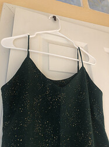
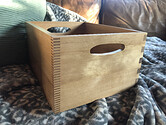

#### **寫下一件今年發生的，你想永久紀錄下來的事情。**

我想永远永远记住，是在今年我认识了很多很多很好很好的姐妹们。在异国他乡十年，我以为自己已经说服了自己其实不需要一个社交圈也可以过得很好。但是今年从参加耶仔的读书会开始，到discord的交流，让我后知后觉地意识到其实我是很迫切的需要这样一个community的。无论是在我困惑的时候，焦虑的时候，快乐的时候，还是兴奋的时候，能有一个地方分享我的情绪，得到大家的支持和鼓舞，和大家一起聊天一起写sql一起模拟面试一起学习的时间，都是疫情间发生在我身上最好的一件事情。
谢谢大家的温柔相待。

#### **整整兩年過去了，疫情仍在繼續。相比起兩年前，疫情如何改變了你的生活？你認為還能恢復原狀嗎？**

生活上，我已经两年没有去人多的餐厅吃饭了，也没有因为娱乐出远门旅游过。这两点我是有很希望能回复原样的！（也许就是明年！）
工作上，我从每天都去实验室变成了一个经常性怀疑人生的人。我意识到了实验室的环境对于我而言是多么重要的促进我对于学术热情和专注的因素。但是也因为离开了环境，我可以更加纯粹的思考自己到底需要什么，喜欢什么，想追求什么。这方面我不觉得我的思考方式可以回到之前的只考虑学术的自己了。
精神上，我在2020年经历了比较严重的一次depressive episode。虽然和真正的抑郁症不值一提，但是让我管中窥豹似的理解了mental burden的重量。2021年我花费了很多精力照顾自己的情绪，从小事里夸奖自己，做让自己情绪上舒服的事情，允许自己逃避给自己带来负面情绪的事情。现在虽然偶尔还有episode但是没有那么严重过。虽然我不觉得我会完全回到之前的自己，但是我还是相信可以做开心的自己。

#### **2021 年，你（終於）在哪些地方躺平了？**

2021年，我终于接受了自己是三分钟热度的性格。逐渐发现我比较擅长三分钟热度迅速点亮新技能点，在初期学习比较快。但是很不擅长通过长时间坚持来精通某一技能。同时矛盾的是本身（被灌输的？）价值观是做事和学习应该精而深而不是浅而广。每次劝自己学习新东西快也是一个特长的时候都觉得是在为自己无法坚持而找借口。但我的兴趣和专注力真的转移得非常快，而且没兴趣之后就很难坚持。今年拥抱自己这个特性，让自己试试能探索多少个兴趣爱好，结果是种了很多绿植，做了木工（一块切菜板+一个木箱子），自己给自己缝了一条裙子，还学会了打壁球，而且继续开始学习日语了，也比之前都更坚持的在读书。当一个兴趣没那么有意思时我就会开始尝试下一个。一年下来觉得收获也不小。

（绿色布料上的闪光很漂亮！）

#### **2021 年，什麼事情讓你獲得最深的意義感或給你最大的力量感？**

今年借着耶仔的读书会，我读了~~很多~~几本女权相关的书和电影/电视剧。读书让我了解自己思维的局限性，意识到这个世界有那么多知识和经历已经存在，但我之前都一无所知。回想今年，我觉得自己终于砸开了一扇窗，开始从另一个角度观察这个世界。获得与主流叙事不同的，非父权制主导的perspective这件事情让我觉得很有意义。就好像《醒来的女性》的题目一样，在睁开眼之前我们都不闻不顾不知不觉地睡着，但是一旦醒来就再也无法再次闭上眼睛了。我迫不及待地想要知道她人的遭遇和故事，她人的想法和结论，我相信知道的越多就会越有力量。

#### **2021 年，你經歷的一場告別或一次相遇**

2021年和对象开始了异地。我们在一起五年多，一开始恋爱就异地两年，终于搬到一个城市的一年后结婚，再一年后一起领养了栗栗（一只中华田园犬），第五年又因为不可抗力要再次开始异地。心里是有些忐忑的，但是和刚开始恋爱的时候很不同的忐忑。刚开始的时候担心的是这段感情会不会坚持下去以及能不能带给彼此幸福感。现在则是很多很多的不舍和生活上转换成一个人的生活的recalibrate。但是整体而言我觉得我们适应得都还可以。我和对象都是比较粘彼此和社恐的性格，因为找到了彼此所以开始觉得不需要他人陪伴，甚至因为一开始的麻烦而有些不喜欢和不熟悉的人交往。所以异地反而让我有了更多社交的时间，找到了一起打壁球的小伙伴。我也终于因为时差让自己成为了半个晨型人，体验了看着天色从漆黑到明亮的感觉（莫名的美妙！）。养成了几个早上的morning route，也算是做到了人生总想尝试的一件事情。最最重要的是离开之后的重逢让人也更加珍惜彼此的陪伴。现在的人生目标之一就是两个人的努力得到结果，可以结束异地恋。

#### **跟我們分享你在 2021 年相遇的一本好書、一部好電影或一首好歌**

Bo Burham的inside：我觉得是2021年最棒的脱口秀。表达出了很多我对于疫情的感受，但是又真的很好笑。

Mrs.America：我觉得对于人物的刻画挺深刻的。让我了解了很多原来不知道的事情和人物。

#### **分享一張照片**

我让对象带着栗栗站到海边一块石头上拍照，然后猝不及防的一波浪涌来。我拿着手机一边拍照一边狂笑一边后退，对象和栗栗站在这块石头上孤零零的面对汹涌的大海。中途栗栗还试图跳入海中被中途拦截。是一张我每次看到都要笑起来的照片。借此提醒自己人生可能会给我们很多意外，但是正是意外才能给我们带来未曾期待过的惊喜。

#### **請填空：2021，＿＿ matters**

2021, **your mood** matters.

学习到的最大的一课就是辨别，承认，尊重自己的感受。希望明年也能做到！

#### **這題留給你，請向自己發出一個靈魂的提問，然後寫下你的回答）**

- 会找到自己热爱的，让自己终于满足到可以停下搜寻的脚步的职业吗？
- 可能会，可能不会，但是都没关系，在路上我已经见到最美的风景，遇到了最温柔的人。